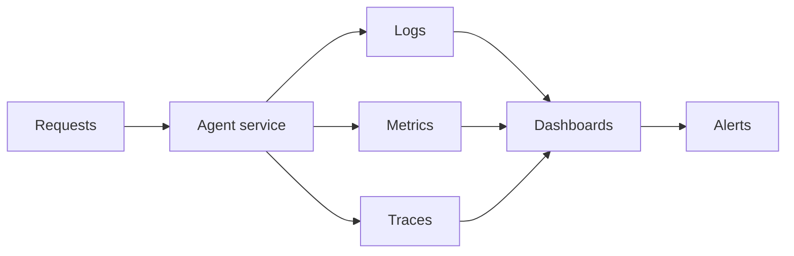

Observability gives visibility into AI system behavior so teams can detect quality, safety, and reliability issues early.

## What to monitor

- Accuracy and hallucination rate.
- Latency (P50/P95).
- Token and tool cost.
- Safety violation counts.
- Tool/API failure rates.
