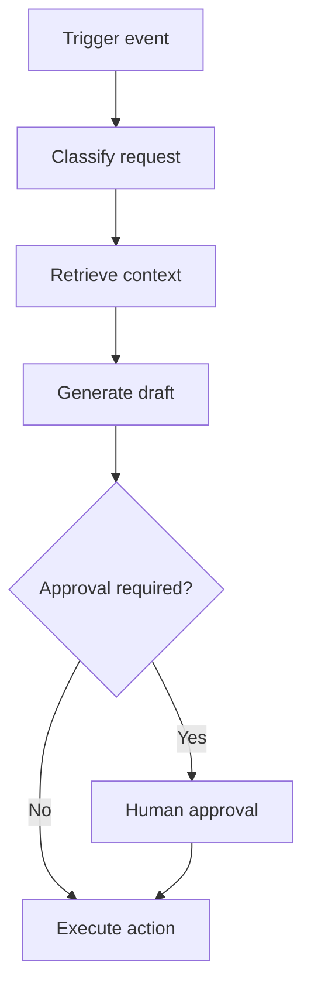

Automation workflows connect triggers, AI steps, business rules, and external actions.

## Core design points

- Idempotency for safe retries.
- Timeout and fallback handling.
- Audit logging of each step.
- Manual override path for failures.

## Example

New support ticket -> classify urgency -> retrieve policy -> draft response -> manager approval for critical cases -> send reply.
